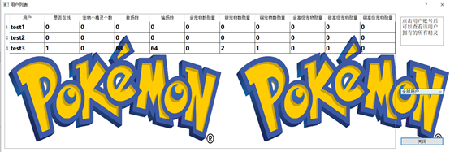

**Note:** if any student find this repository for his/her college course, DO NOT copy and submit directly.  
**注意：** 如果有哪位学弟学妹发现了这个仓库，千万不要直接抄下来，可能会有你意想不到的情况发生。

# Pokemon Battle Game - Online

This game is a simple Pokemon battle game, developed in 2020-08 by Michael Chen.

Only Chinese version.

Include: Front-end, Back-end, source pictures.

Using: Qt 5.12, MySQL

5000 lines code, though just for fun. Honestly, only a entertainment for myself, the mechanism, operability and strategy are not appropriate for users.

So basically, it's a LEARNING VERSION of my little game, I only provide source code but not the executable file.

## Outline

## Login

## Game Widgets

## Battle

